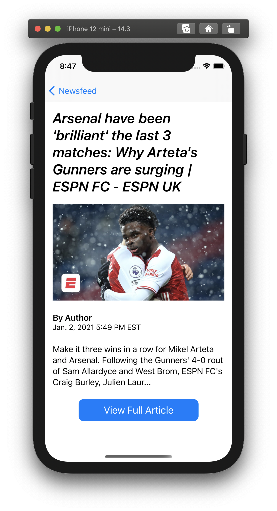
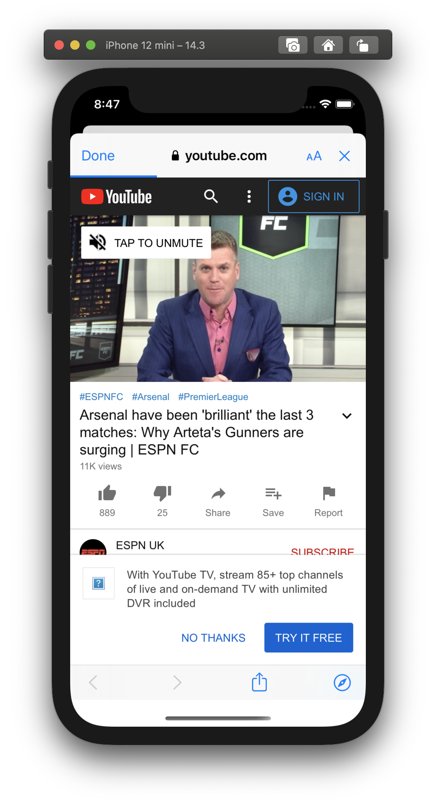
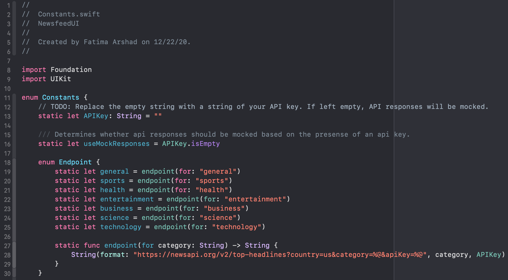
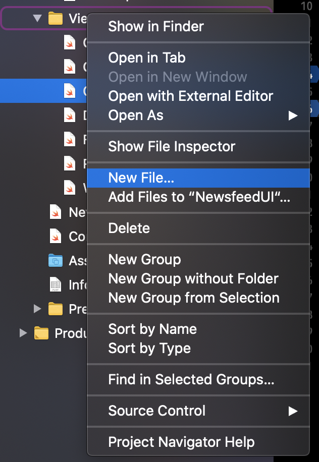

# NewsfeedUI

In this workshop we'll be building a basic news app that will display different categories of news articles and allow users to view details on each article. Our main interface will be a vertically scrolling list containing horizontal scroll views for different categories (sports, health, business, etc.). Throughout this workshop, we'll primarily explore how to build composable views that we can put together to create more complex views. We'll also explore how to navigate between views.

      

## 1. Initial Project Setup

1. Open your Terminal, and navigate to the directory in which you want to download the repository
2. Run the following command in Terminal to clone the repo: `git clone https://github.com/C1-SoftwareEngineeringSummit/NewsfeedUI.git`
3. Navigate to the starter project within the newly cloned repo: `cd NewsfeedUI/NewsfeedUI-Starter`
   * **NOTE:** You can also use the Finder app to navigate to `NewsfeedUI-Starter`
4. Open the starter project in Xcode by running the following command: `xed .`
   * **NOTE:** You can also double-click the `NewsfeedUI-Starter.xcodeproj` file in using the Finder app
5. Once the project is open in Xcode, click on the top level folder (NewsfeedUI-Starter) in the project navigator, then click on "General" settings, and then look for the "Identity" settings section
6. Inside Identity settings, modify the "Bundle Identifier" by adding your name to the end of it. For example, change it from `com.ses.NewsfeedUI-Starter.MyName` to `com.ses.NotesUI-Starter-SteveJobs`
   * **NOTE:** The goal is to have a unique bundle identifier. Your app won't compile if the bundle identifier is not unique.
7. Build and run the project to make sure everything is working fine. Press the symbol near the top left corner of Xcode that looks like a Play ▶️ button or use the shortcut: `⌘ + R`


### Getting Set Up for API Calls

If you want this app to work with real API calls, make sure to get a [News API development key](https://newsapi.org/docs/get-started). This will allow the app to fetch real data. But if you don't have a key, don't worry - this workshop is also set up so that you can use mock data without an API key.

If you do get a key, feel free to open up the `Constants.swift` file under the `Resources` group, and replace the `static let APIKey` empty string with your personal key. This will set the `useMockResponses` variable to `false`, triggering networking code to hit live data. However, it might be best to do this after going through the workshop because some of the Xcode previews will either be missing or show placeholder values when using live data.



### Provided Files & Resources

In this workshop, there are a few pre-made files that we'll be using to make things a little easier.

The first file is `Constants.swift`. If you have a personal API key to use, you've probably already looked at this file. It's not very complicated, just a place to keep a few constants that are used throughout the rest of the workshop.

Next is `APIResponse.swift`. In this file, you'll find the classes `NewsArticle` and `NewsApiResponse`. These are the data models for our app. `NewsArticle` represents a single article, and `NewsApiResponse` represents a response from the News API, which contains an array of `[NewsArticle]`'s.

`Models.swift` contains a class called `NewsFeed`. This class will fetch and store all of the different news articles from the API. It has a property for each category of news (`general`, `sports`, `health`, `entertainment`, `business`, `science`, & `technology`). These properties are arrays of `NewsArticle`'s corresponding to the different categories. As you can see, `NewsFeed` implements the `ObservableObject` protocol. An `ObservableObject` will publish announcements when it's values have changed so that SwiftUI can react to those changes and update the user interface. The properties in this class (`general`, `sports`, `health`, `entertainment`, `business`, `science`, & `technology`) are all marked as `@Published`, which tells SwiftUI that these properties should trigger change notifications. Later on in the workshop, you'll see how these properties are used to reactively display news articles. If you want to read more about this topic, [this is a good place to start](https://www.hackingwithswift.com/quick-start/swiftui/observable-objects-environment-objects-and-published). `NewsFeed` also contains a `static var sampleData`, which is just an array of sample news articles that we will use to test our app throughout the workshop.

Under the "Views" group, we have also have `RemoteImage.swift`. This class defines a `View` called `RemoteImage` that will download and display an image from any URL that you provide to it. The implementation details are a bit out of the scope of this tutorial, but we will at least see how to use this `View` later on in the workshop.

Lastly, we have `WebView.swift`. This struct is a SwiftUI wrapper around a `SFSafariViewController` which allows us to present a Safari browser view in SwiftUI. Again, this is a bit out of the scope of this tutorial, but feel free to check it out.

## 2. Displaying Featured Articles

The first thing that we'll do in this workshop is create a view that can display multiple featured articles in a "carousel" (or page view). Users will be able to swipe left and right to view different featured articles, and a page control at the bottom will display the current page in the form of highlighted dots.


## CarouselView
First, we'll build a `CarouselView`, which will display multiple pages of content and allow users to swipe left and right between different pages.

1. Create a new SwiftUI file in the `Views` folder called `CarouselView.swift`

* To create a new file in the `Views` folder, right-click on the folder and select `New File...`
* Filter the file types for `SwiftUI View` and select that file type
* Name the file `CarouselView.swift`, make sure the `NewsfeedUI` target is selected in the `Targets` list, and click `Create`




2. Insert a `var` at the top of the `CarouselView` struct called `articles` that is of type `[NewsArticle]`

```swift
struct CarouselView: View {
    var articles: [NewsArticle]
```

* `articles` will store an array of `NewsArticle`'s that should be displayed in the `CarouselView`.

3. Update the `PreviewProvider` to initialize the preview with a list of sample `NewsArticle`'s

```swift
struct CarouselView_Previews: PreviewProvider {
    static var previews: some View {
        CarouselView(articles: Array(NewsFeed.sampleData.prefix(3)))
    }
}
```

* This will retrieve the first 3 `NewsArticle`'s in our `sampleData` and pass them to the `CarouselView` in the preview.

4. Replace the `Text` in the `body` with a `TabView` that contains the `title` of each article in the `articles` array:

```swift
var body: some View {
    TabView() {
        ForEach(articles) { article in
            Text(article.title)
        }
    }
    .aspectRatio(3 / 2, contentMode: .fit)
    .tabViewStyle(PageTabViewStyle())
    .indexViewStyle(PageIndexViewStyle(backgroundDisplayMode: .always))
}
```

* The `ForEach` loop goes through the `articles` array and creates a `Text` view for each `article` in the array. For now, the `article`'s `title` is the only thing displayed in the `CarouselView`.
* A `TabView` is a `View` that can switch between different child views. In our case, the child views are the different article titles displayed by `Text(article.title)`. The `TabView` is the most important piece of our `CarouselView` since it's what allows us to swipe between different featured `NewsArticle`'s.
* `.aspectRatio(3 / 2, contentMode: .fit)` sets the aspect ratio of our `TabView` to 3:2 (width:height). By setting `.contentMode` to `.fit` we tell the `TabView` to scale up or down so that it fits perfectly within a 3:2 frame.
* `.tabViewStyle(PageTabViewStyle())` sets our `TabView`'s style to `PageTabViewStyle`. This is what makes our `TabView` appear as a page view (or "carousel") with highlighted dots to track our tab position. Without this style, our `TabView` would appear with a full tab bar at the bottom of the screen, much like the iOS Music or Phone app.
* `.indexViewStyle(PageIndexViewStyle(backgroundDisplayMode: .always))` is what causes the highlighted dots to appear at the bottom of our `TabView`. We are setting the page index (the highlighted dots) to be displayed with a background `.always`. We will actually remove this line later, but for now it allows us to view the highlighted dots on a white background.

> At this point, you can resume your Canvas preview to see how the `CarouselView` looks so far. If the Canvas is not visible, you can open it by using the small menu to the right of your file tabs. If your Canvas preview is paused, there will be a "Resume" button at the top of the Canvas that you can use. Alternatively, you can use the shortcut `CMD + OPT + P` to refresh the Canvas preview.


> You can also press the circular ▶️ button directly above the simulator in your Canvas. This will start a live preview of the `CarouselView`. You can use your cursor to swipe the pages left and right, and the highlighted dots at the bottom should update as well. Click the ⏹️ button to stop the live demo.

   


### FeatureView

Our `CarouselView` works okay for now, but it lacks visual appeal. To fix this, we're going to create a new `FeatureView` that will replace the `CarouselView`'s existing `Text(article.title)`. `FeatureView` will display an article's image with the title overlayed on top of it.


1. Create a new SwiftUI file in the `Views` folder called `FeatureView.swift`

* To create a new file in the `Views` folder, right-click on the folder and select `New File...`
* Filter the file types for `SwiftUI View` and select that file type
* Name the file `FeatureView.swift`, make sure the `NewsfeedUI` target is selected in the `Targets` list, and click `Create`

2. Insert a `var` at the top of the `FeatureView` `struct` called `article` that is of type `NewsArticle`:

```swift
struct FeatureView: View {
    var article: NewsArticle
```

* This will contain the `NewsArticle` that this `FeatureView` will display.

3. Update the `PreviewProvider` to initialize the preview with a sample `NewsArticle`

```swift
struct FeatureView_Previews: PreviewProvider {
    static var previews: some View {
        FeatureView(article: NewsFeed.sampleData[0])
    }
}
```

4. Replace the `Text` View in the `body` with a `RemoteImage` View for the current `article`:

```swift
var body: some View {
    RemoteImage(url: article.urlToImage)
        .aspectRatio(3 / 2, contentMode: .fit)
}
```

* We use a `RemoteImage` to download and display the image for this `article`. If you haven't added your API key to `Constants.swift`, `RemoteImage` won't make any network requests. Instead, it displays a random image from our `Assets.xcassets` catalog. If you do however add your API key, `RemoteImage` will try to make a network request to pull the live image from the url. Be aware that doing so will cause a default placeholder image to show up in the Canvas preview!
* `.aspectRatio(3 / 2, contentMode: .fit)` sets the aspect ratio for the `RemoteImage` and resizes it to fit into a 3:2 frame.

5. In the same file, add a new `TextOverlay` `View` that will overlay the `NewsArticle`'s `title` on top of the `RemoteImage`. This new `View` should go after the `FeatureView` `struct`, but before `FeatureView_Previews`.

```swift
struct TextOverlay: View {
    var text: String

    var gradient: LinearGradient {
        LinearGradient(
            gradient: Gradient(
                colors: [Color.black.opacity(0.8), Color.black.opacity(0)]
            ),
            startPoint: .bottom,
            endPoint: .center
        )
    }

    var body: some View {
        ZStack(alignment: .bottomLeading) {
            Rectangle()
                .fill(gradient)
            Text(text)
                .font(.headline)
                .padding()
                .padding(.bottom, 25)
        }
        .foregroundColor(.white)
    }
}
```

* `var text` will contain the text that is displayed by this overlay. In our app, this will contain the article's `title`.
* `gradient` is a `LinearGradient`. This is a blend between two colors over a given distance. Here, we are transitioning from almost-opaque black at the bottom of the `gradient`, to clear in the center of the `gradient`. This gradient will darken the bottom half of our `RemoteImage`, allowing the white `text` to stand out on top of any `RemoteImage`.
* The `body` of the `TextOverlay` is a `ZStack` that places the `text` on top of the `gradient`. Both of these views are aligned using their `.bottomLeading` (bottom-left) corners.
* The `Text` has some standard `.padding()` applied to all edges, as well as 25 points of additional `.padding` on the `.bottom` edge. This creates enough space at the bottom so our `text` and the highlighted dots of our `CarouselView` don't overlap.
* `.foregroundColor(.white)` sets the color of our `text` to `.white`.

6. Add a `TextOverlay` to the `FeatureView`'s `RemoteImage`
```swift
var body: some View {
    RemoteImage(url: article.urlToImage)
        .aspectRatio(3 / 2, contentMode: .fit)
        .overlay(TextOverlay(text: article.title))
}
```

> Resume the Canvas preview if you haven't already, and see what the `FeatureView` looks like now! You can use the shortcut `CMD + OPT + P` to refresh the Canvas preview.


Before we move on, your entire `FeatureView.swift` should look like this:

```swift
import SwiftUI

struct FeatureView: View {
    var article: NewsArticle

    var body: some View {
        RemoteImage(url: article.urlToImage)
            .aspectRatio(3 / 2, contentMode: .fit)
            .overlay(TextOverlay(text: article.title))
    }
}

struct TextOverlay: View {
    var text: String

    var gradient: LinearGradient {
        LinearGradient(
            gradient: Gradient(
                colors: [Color.black.opacity(0.8), Color.black.opacity(0)]
            ),
            startPoint: .bottom,
            endPoint: .center
        )
    }

    var body: some View {
        ZStack(alignment: .bottomLeading) {
            Rectangle()
                .fill(gradient)
            Text(text)
                .font(.headline)
                .padding()
                .padding(.bottom, 25)
        }
        .foregroundColor(.white)
    }
}

struct FeatureView_Previews: PreviewProvider {
    static var previews: some View {
        FeatureView(article: NewsFeed.sampleData[0])
    }
}
```

### Putting It Together

Now that we've created a nice `FeatureView`, we can use it within our `CarouselView`!

1. Open `CarouselView.swift` once more and replace the `Text` inside of the `ForEach` loop with a `FeatureView`. You can also remove the `.indexViewStyle` modifier. `CarouselView.swift` should now look like this:

```swift
import SwiftUI

struct CarouselView: View {
    var articles: [NewsArticle]

    var body: some View {
        TabView() {
            ForEach(articles) { article in
                FeatureView(article: article)
            }
        }
        .aspectRatio(3 / 2, contentMode: .fit)
        .tabViewStyle(PageTabViewStyle())
    }
}

struct CarouselView_Previews: PreviewProvider {
    static var previews: some View {
        CarouselView(articles: Array(NewsFeed.sampleData.prefix(3)))
    }
}
```

> Resume the Canvas preview now to see the completed `CarouselView`! You can also start a live preview in the Canvas to make sure that you are still able to swipe left and right between different `FeatureView`'s in the carousel.


## 3. Displaying Categories of Articles

In this section we'll create the view that displays categories of articles. This new view will display multiple article "cards" in a horizontal scroll view. Each of these horizontal scroll views will contain all articles from a given category (e.g. technology, business, sports, music, etc).


### CategoryRow

First, we will build a horizontal scroll view to contain all of the articles in a single category. We'll call it `CategoryRow`.

1. Create a new SwiftUI file in the `Views` folder called `CategoryRow.swift`

2. Insert two `var`s at the top of the `CategoryRow` struct called `categoryName` and `articles`:

```swift
struct CategoryRow: View {
    var categoryName: String
    var articles: [NewsArticle]
```

* `categoryName` is the name of this category ("Technology", "Business", "Sports", "Music", etc.)
* `articles` is an `Array` of `NewsArticle`s that belong to this category

3. Update the `PreviewProvider` to initialize these two `var`s in the preview:

```swift
struct CategoryRow_Previews: PreviewProvider {
    static var articles = NewsFeed.sampleData

    static var previews: some View {
        CategoryRow(categoryName: "Sports", articles: articles)
    }
}
```

4. Update the `Text` in the `body` to display the `categoryName` rather than the static `"Hello, World!"` text:

```swift
var body: some View {
    Text(categoryName)
        .font(.title)
}
```

* We use `.font(.title)` to style this `Text` as a `.title`.

5. Add an `HStack` (horizontal stack) View below the `Text` View that will contain all of the articles in the given category:

```swift
var body: some View {
    Text(categoryName)
        .font(.title)

    HStack(alignment: .top, spacing: 0) {
        ForEach(articles) { article in
            Text(article.title.prefix(10))
        }
    }
}
```

* When we create the `HStack`, we define the `alignment` to be `.top`, meaning that all of the items in the `HStack` will have their top edges aligned.
* The `ForEach` loop goes through the `articles` array and creates a `Text` for each `article` in the array. For now, the `Text` only displays the first 10 characters in the `article`'s `title`.

6. Group the category name Text View and the horizontal stack View together inside a `VStack` (vertical stack View):

```swift
var body: some View {
    VStack(alignment: .leading) {
        Text(categoryName)
            .font(.title)

        HStack(alignment: .top, spacing: 0) {
            ForEach(articles) { article in
                Text(article.title.prefix(10))
            }
        }
    }
}
```

* We use `.leading` alignment to align all of the vertically stacked content to the leading (left) edge.
* This `VStack` will place the category name directly above the horizontal stack of articles.
* If you try to resume the Canvas preview at this point, it will look pretty terrible! This is because our `HStack` doesn't scroll yet and therefore squishes all of its content onto the screen at once.

7. Add some padding to the category name, and wrap the `HStack` in a `ScrollView`:

```swift
var body: some View {
    VStack(alignment: .leading) {
        Text(categoryName)
            .font(.title)
            .padding(.leading, 15)
            .padding(.top, 5)

        ScrollView(.horizontal, showsIndicators: false) {
            HStack(alignment: .top, spacing: 0) {
                ForEach(articles) { article in
                    Text(article.title.prefix(10))
                }
            }
        }
    }
}
```

* The padding will give our `categoryName` some breathing room on the `.top` and `.leading` (left) edges.
* Wrapping the `HStack` in a `ScrollView` allows the content in the `HStack` to stretch out and take up as much space as it needs! Now the article titles aren't squished together.
* Our `ScrollView` specifies `.horizontal`, meaning it only scrolls horizontally.
* `showsIndicators: false` means that the `ScrollView` won't show scroll indicators (like you would typically see on the right side of a web page).

> At this point, press the circular ▶️ button to start a live preview of the `CategoryRow` in your Canvas. You can use your cursor to swipe the `ScrollView` and see it in action! Again, click the ⏹️ button to stop the live demo.


### CategoryItem
Next, we'll build a `CategoryItem` View that will display a single news article as a thumbnail and a title. Multiple `CategoryItem`s will go inside our `CategoryRow`'s horizontal `ScrollView` to display an entire category of news articles. The image below shows how our `CategoryItem` will look.


1. Create a new SwiftUI file in the `Views` folder called `CategoryItem.swift`

2. Add a `var` called `article` that will contain the specific `NewsArticle` to display on this card:

```swift
struct CategoryItem: View {
    var article: NewsArticle
```

* When we initialize a new `CategoryItem` we will provide the specific `NewsArticle` to display in the card.

3. Update the `PreviewProvider` to initialize the `CategoryItem` with a sample `NewsArticle`:

```swift
struct CategoryItem_Previews: PreviewProvider {
    static var previews: some View {
        CategoryItem(article: NewsFeed.sampleData[0])
    }
}
```

4. Replace the `body` of your view with the following code:

```swift
var body: some View {
    VStack(alignment: .leading) {
        RemoteImage(url: article.urlToImage)
            .scaledToFill()
            .frame(width: 155, height: 155)
            .clipped()
            .cornerRadius(5)

        Text(article.title)
            .lineLimit(5)
            .font(.headline)
    }
    .frame(width: 155)
    .padding(.leading, 15)
}
```

* This `VStack` is just like the one we used in `CategoryRow`. It contains a `RemoteImage` View and a `Text` View below it. The `RemoteImage` displays the thumbnail for the `article`, and the `Text` displays the `article`'s `title`.

> **NOTE:** If you never added your API key to `Constants.swift`, `RemoteImage` will pull from our locally saved images. Otherwise, `RemoteImage` will try to pull the live image. But again, be aware that doing so will cause a default placeholder image to show up in the Canvas preview!

* `.frame(width: 155, height: 155)` will give our image a square frame of 155 points.
* `.scaledToFill()` means that the image will scale to fill the entire 155pt x 155pt frame, and `.clipped()` means that any parts of the image outside of the frame will not be visible.
* `.cornerRadius(5)` will round the corners of our image with a 5pt radius.
* On our `Text`, `.lineLimit(5)` prevents the `title` from extending beyond 5 lines. Any text beyond the 5 line limit will be truncated with a trailing `...`.
* We also specify `.frame(width: 155)` for the entire `VStack`. This restricts the entire `VStack` to a width of 155pt, so that none of the `article`'s `title` will extend beyond the edge of the image. Instead, it will wrap around. You can see this in the Canvas if you resume the preview.
* We also added `.padding` to the `.leading` (left) edge of the `VStack`. When the `CategoryItem`s are lined up horizontally, this padding will provide 15 points of space between each item, and it will also provide 15 points of space between the first item and the left edge of our phone screen.

> Make sure to open the Canvas and resume the preview to visualize an individual `CategoryItem`!


Before we move on, your entire `CategoryItem.swift` should look like this:

```swift
import SwiftUI

struct CategoryItem: View {
    var article: NewsArticle

    var body: some View {
        VStack(alignment: .leading) {
            RemoteImage(url: article.urlToImage)
                .scaledToFill()
                .frame(width: 155, height: 155)
                .clipped()
                .cornerRadius(5)

            Text(article.title)
                .lineLimit(5)
                .font(.headline)
        }
        .frame(width: 155)
        .padding(.leading, 15)
    }
}

struct CategoryItem_Previews: PreviewProvider {
    static var previews: some View {
        CategoryItem(article: NewsFeed.sampleData[0])
    }
}
```

### Putting It Together

At this point, we have everything we need to create a complete `CategoryRow`, so lets integrate the `CategoryItem` into the horizontal `ScrollView`.

1. Open `CategoryRow.swift`, and replace `Text(article.title.prefix(10))` with a `CategoryItem` that displays the current `article`. Your `CategoryRow.swift` should now look like this:

```swift
import SwiftUI

struct CategoryRow: View {
    var categoryName: String
    var articles: [NewsArticle]

    var body: some View {
        VStack(alignment: .leading) {
            Text(categoryName)
                .font(.title)
                .padding(.leading, 15)
                .padding(.top, 5)

            ScrollView(.horizontal, showsIndicators: false) {
                HStack(alignment: .top, spacing: 0) {
                    ForEach(articles) { article in
                        CategoryItem(article: article)
                    }
                }
            }
        }
    }
}

struct CategoryRow_Previews: PreviewProvider {
    static var articles = NewsFeed.sampleData

    static var previews: some View {
        CategoryRow(categoryName: "Sports", articles: articles)
    }
}
```

> If you restart live preview in the Canvas, you should be able to see your completed `CategoryRow`! Each article should have a "card" displaying a thumbnail and a title, and the whole category of articles should scroll horizontally.


## 4. Building the Home Screen

Now that we've created a `CarouselView` and `CategoryRow`, we can use those two pieces to create the home screen of our app! The home screen will contain a `CarouselView` at the top to highlight a few trending stories, and multiple `CategoryRows` to group articles with related content.


1. Open `ContentView.swift`. This `View` is the first screen that a user sees when they open the app for the first time.

2. Add the following property to the `ContentView` struct:

```swift
struct ContentView: View {
    @ObservedObject var newsFeed = NewsFeed()
```

* `@ObservedObject` is a property wrapper. It tells our `ContentView` to observe the state of the `newsFeed` and react to any changes. This means that when the `newsFeed` changes, any views that depend on it will be reloaded. This happens when our app finishes fetching news articles and loads them into the `newsFeed`.
* `NewsFeed` is our API request engine. When we create this object, it makes a few different API requests to retrieve different categories of news articles. After these API calls complete, we can access the General category of articles by using `newsFeed.general`, for example. Again, if you set up your API key at the beginning of this tutorial, you will be fetching live data, but be aware that this will cause the Canvas preview to show up blank.

3. In the `body`, wrap the existing `Text` inside of a `NavigationView` and give it a `.navigationTitle`:

```swift
var body: some View {
    NavigationView {
        Text("Hello, World!")
            .navigationTitle("Newsfeed")
    }
}
```

* `NavigationView` is used to build hierarchical navigation. It will add a navigation bar to our screen, which will contain the title set by `.navigationTitle("Newsfeed")`. Later on, this `NavigationView` will allow us to navigate to new screens when we tap on different articles.

4. Next, replace the `Text` with a `List` that contains just the `CarouselView` for now:

```swift
var body: some View {
    NavigationView {
        List {
            if !newsFeed.general.isEmpty {
                CarouselView(articles: Array(newsFeed.general.prefix(5)))
                    .listRowInsets(EdgeInsets())
            }
        }
        .listStyle(PlainListStyle())
        .navigationTitle("Newsfeed")
    }
}
```

* A `List` is just a container that will present rows of data arranged in a single column. Right now, we are only providing one row of data, which is our `CarouselView`.
* Before we add the `CarouselView` to the `List`, we check to see if `!newsFeed.general.isEmpty`. We do this because we need at least 1 article in `newsFeed.general` in order to create a `CarouselView`. Otherwise, we would have nothing to display. If there's at least 1 article in `newsFeed.general`, we display the `CarouselView`. Otherwise, we don't add it to the `List`.
* When we create the `CarouselView`, we provide it with `Array(newsFeed.general.prefix(5))`. This is will take up to 5 articles from the General category, and display them in the `CarouselView`.
* We use `.listRowInsets(EdgeInsets())` to set the edge insets to zero for the `CarouselView`. Adding the `PlainListStyle()` style modifier removes the insets from the entire list. This combined with the row insets allows the content to extend to the edges of the screen.

5. Add 3 `CategoryRow`'s to the `List`, one for each of the categories Sports, Health, and Entertainment (you can choose different categories later if you wish):

```swift
var body: some View {
    NavigationView {
        List {
            if !newsFeed.general.isEmpty {
                CarouselView(articles: Array(newsFeed.general.prefix(5)))
                    .listRowInsets(EdgeInsets())
            }

            if !newsFeed.sports.isEmpty {
                CategoryRow(categoryName: "Sports", articles: newsFeed.sports)
                    .listRowInsets(EdgeInsets())
            }

            if !newsFeed.health.isEmpty {
                CategoryRow(categoryName: "Health", articles: newsFeed.health)
                    .listRowInsets(EdgeInsets())
            }

            if !newsFeed.entertainment.isEmpty {
                CategoryRow(categoryName: "Entertainment", articles: newsFeed.entertainment)
                    .listRowInsets(EdgeInsets())
            }
        }
        .navigationTitle("Newsfeed")
    }
}
```

* For each of these categories, we use an `if` statement to make sure the category has at least 1 article. If there is at least 1 article, we add a `CategoryRow` to the `List`. Otherwise, we don't add anything to the `List` for the empty category.
* The `CategoryRow`'s are given a `categoryName` and a list of `articles` to display. For instance, the `CategoryRow` for Sports is given the name `"Sports"` and the `newsFeed.sports` articles. This uses the `CategoryRow` that we built earlier to display all of the Sports articles in a horizontal `ScrollView`. This is the same for the other categories as well.
* Each `CategoryRow` uses `.listRowInsets(EdgeInsets())`, which sets the edge insets to zero. Again, this allows the content to extend to the very edges of the screen.

> Refresh the Canvas and start a live preview. You should be able to see your completed home screen! You should be able to scroll horizontally between different articles in the `CarouselView`, and you should be able to scroll vertically to view all of the different categories of articles. Additionally, each `CategoryRow` should scroll horizontally.


## 5. Displaying Article Details

Now that we have our articles displayed in the home screen, we want to be able to click on those articles to view more details. This detail view will provide important summary information about the article including the title, image, author, date published, summary text, and a button that links to the entire article.

### Creating the DetailView UI


1. Create a new SwiftUI file in the `Views` folder called `DetailView.swift`

2. Add a `var` called `article` that will contain the specific `NewsArticle` to display on this page:

```swift
struct DetailView: View {
    var article: NewsArticle
```

* When we initialize a new `DetailView` we will provide the specific `NewsArticle` to display in the page.

3. Update the `PreviewProvider` to initialize the `DetailView` with a sample `NewsArticle`:

```swift
struct DetailView_Previews: PreviewProvider {
    static var previews: some View {
        DetailView(article: NewsFeed.sampleData[4]) // using 4 to get good representative data
```

4. Replace `body` with the following code:

```swift
var body: some View {
    VStack(alignment: .leading) {
        Text(article.title)
            .italic()
            .font(.title)
            .fontWeight(.semibold)

        RemoteImage(url: article.urlToImage)
            .aspectRatio(contentMode: .fit)
            .padding(.bottom)

        Text("By: \(article.author ?? "Author")")
            .bold()

        Text(article.datePublished)
            .font(.subheadline)
            .padding(.bottom)

        Text(article.description ?? "Description")
            .font(.body)
            .padding(.bottom)

        Button("View Full Article") { }
            .font(.title3)
            .padding(.vertical, 10)
            .padding(.horizontal, 50)
            .foregroundColor(.white)
            .background(Color.blue)
            .cornerRadius(10)
    }.padding()
}
```
* A `VStack` with `leading` alignment and `padding` is added to wrap the following views:
* The `Text` View is updated to use the `article.title` and modifiers are added for `italic` type, `title` font, and `semibold` font weight.
* `RemoteImage` is added underneath the title with `bottom` padding and an `aspectRatio` set to `fit` to fill or shrink the image to fit the screen's width.
* We add another `Text` View for the article's author with `bold` weight below the image. Notice how we're using string interpolation `"\(...)"` here to insert code into the string literal. This allows us to use the nil coalescing operator `??` to provide a default value if the optional variable `article.author` is nil.
* Next, the published date is added in a `Text` View with `subheadline` font and `bottom` padding.
* Followed by another `Text` View with `body` font and `bottom` padding. Notice how we need to use the nil coalescing operator again to provide a default value if `article.description` is nil.
* The last view added is a `Button` using the trailing closure version of `Button(title: StringProtocol, action: () -> Void)`, but we're omitting the action code (what's executed when the button is tapped) in the closure for now. We're also adding a handful of style modifiers including `title3` font, 10 points of `vertical` and 50 points of `horizontal` padding to stretch the button lengthwise, `white` `foregroundColor` for the button text, `blue` `background` color, and a `cornerRadius` of 10 adds curved corners to the button. 

5. Adding too much style in your main view can get messy, so let's refactor this style into a separate struct that conforms to the `ButtonStyle` protocol. Use the code below to add the new `FilledButtonStyle` struct directly after your `DetailView` struct, then modify the original button with `.buttonStyle(FilledButtonStyle())`.

```swift
          Button("View Full Article") { }
              .buttonStyle(FilledButtonStyle())
        }.padding()
    }
}

struct FilledButtonStyle: ButtonStyle {
    func makeBody(configuration: Self.Configuration) -> some View {
        configuration.label
            .padding(.vertical, 10)
            .padding(.horizontal, 50)
            .font(.title3)
            .foregroundColor(.white)
            .background(configuration.isPressed ? Color(red: 0.0, green: 0.3, blue: 0.8) : .blue)
            .cornerRadius(10)
    }
}
```

* To conform to `ButtonStyle` we need to implement the `makeBody` function which takes a `ButtonStyleConfiguration` parameter. This simply allows us to access properties relevant to the button such as `label` and `isPressed`.
* We add all of our styling we had before to the `configuration.label` property.
* Note: we take advantage of the `configuration.isPressed` property to change the background color to a custom darker shade of blue `Color(red: 0.0, green: 0.3, blue: 0.8) : .blue)`, which gives feedback to the user that the `Button` is in its `pressed` state.

6. You'll notice that the `Button` is left-aligned due to the alignment of its parent `VStack`. We can remedy this by embedding the `Button` inside an `HStack` and adding `Spacer` views before and after the `Button`, centering it horizontally. That looks better!

```swift
HStack {
    Spacer()
    Button("View Full Article") { }
        .buttonStyle(FilledButtonStyle())
    Spacer()
}
```

7. It's possible for the content of `DetailView` to extend past the bottom of the screen. Let's wrap up the UI by embedding our `VStack` inside a `ScrollView` with a `.navigationBarTitleDisplayMode(.inline)` modifier (this makes the nav bar compact when we enter the `DetailView` from another screen). Your code should now look something like this:

```swift
struct DetailView: View {
    var article: NewsArticle

    var body: some View {
        ScrollView {
            VStack(alignment: .leading) {
                Text(article.title)
                    .italic()
                    .font(.title)
                    .fontWeight(.semibold)

                RemoteImage(url: article.urlToImage)
                    .aspectRatio(contentMode: .fit)
                    .padding(.bottom)

                Text("By: \(article.author ?? "Author")")
                    .bold()

                Text(article.datePublished)
                    .font(.subheadline)
                    .padding(.bottom)

                Text(article.description ?? "Description")
                    .font(.body)
                    .padding(.bottom)

                HStack {
                    Spacer()
                    Button("View Full Article") { }
                        .buttonStyle(FilledButtonStyle())
                    Spacer()
                }
            }.padding()
        }.navigationBarTitleDisplayMode(.inline)
    }
}

struct FilledButtonStyle: ButtonStyle {
    func makeBody(configuration: Self.Configuration) -> some View {
        configuration.label
            .padding(.vertical, 10)
            .padding(.horizontal, 50)
            .font(.title3)
            .foregroundColor(.white)
            .background(configuration.isPressed ? Color(red: 0.0, green: 0.3, blue: 0.8) : .blue)
            .cornerRadius(10)
    }
}

struct DetailView_Previews: PreviewProvider {
    static var previews: some View {
        DetailView(article: NewsFeed.sampleData[4])
    }
}
```

Now that we have the `DetailView` UI finished, we need to hook it up to the rest of the app!

## 6. Connecting the DetailView to the Home Screen

We need to be able to navigate to the `DetailView` from two places: `FeatureView`s in the main carousel, and `CategoryItem`s in the category rows.


1. Open up `CarouselView.swift` and embed the `FeatureView` inside a `NavigationLink` with `DetailView(article: article)` as the destination. Add the `.buttonStyle(PlainButtonStyle())` style modifier to the `NavigationLink` to remove the default blue text color.

```swift
ForEach(articles) { article in
    NavigationLink(destination: DetailView(article: article)) {
        FeatureView(article: article)
    }.buttonStyle(PlainButtonStyle())
}
```

* `NavigationLink` is a SwiftUI view that controls navigation presentation behind the scenes. This easily enables us to simply wrap our view we want to click on (the navigation label) and provide the destination view we want to open. Here we use the trailing closure version of `NavigationLink(destination: Destination, label: () -> Label)` or `NavigationLink(destination: Destination) { some view }`.

2. Open up `CategoryRow.swift` and embed the `CategoryItem` inside a `NavigationLink` with `DetailView(article: article)` as the destination. Again, add the `.buttonStyle(PlainButtonStyle())` style modifier.

```swift
ForEach(articles) { article in
    NavigationLink(destination: DetailView(article: article)) {
        CategoryItem(article: article)
    }.buttonStyle(PlainButtonStyle())
}
```

> Switch to `ContentView.swift` and refresh the Canvas to start a live preview. You should now be able to click on elements in the home screen and navigate to the article details, and back again. That's it for the main navigation of the app!

## 7. Customization

Now that the main UI is complete, there are a few things you can to do customize the app to make it your own. 

1. For starters, you may want to change the default news categories that are displayed in the main view. We included support for all of the categories in [News API's top-headlines endpoint](https://newsapi.org/docs/endpoints/top-headlines): `general`, `business`, `entertainment`, `health`, `science`, `sports`, and `technology`. Feel free to display whichever categories you're interested in (or all of them!) by following the process of adding the `CategoryRow`s to the `ContentView`'s list from [4. Building the Home Screen](#4-building-the-home-screen). You can also change the name of the navigation title from "Newsfeed" to whatever you want!

2. Be creative. SwiftUI makes it very easy to modify style across your views. Check out the [SwiftUICheatSheet](SwiftUICheatSheet.md) we provided to customize the look and feel of your app. Some ideas are to change the text font, color scheme, corner radii, etc.

3. If you haven't already, now is a good time to hit live data! Check out [Getting Set Up for API Calls](#getting-set-up-for-api-calls) from section 1 again for a refresher on setting up and adding your News API key. 


## On Your Own: Opening the Full Article from the Detail Page

Now that we can navigate to the `DetailView` from the home screen, let's wrap up by adding functionality to our "View Full Article" button in the `DetailView`.


1. Open up `DetailView.swift` and add a new `var` under `article` called `showWebView` with the `@State` property wrapper and assign it to `false`.

```swift
struct DetailView: View {
    var article: NewsArticle
    @State var showWebView = false
```

* `@State` is a property wrapper that signifies the source of truth for the `showWebView` value in our `DetailView`. You can think of this as a reference type (rather than a value type) that can be mutated by other views when passed to them as a binding `$` (which we'll see in a bit).

2. Replace the `HStack` containing the button code with the following:

```swift
HStack {
    Spacer()
    Button("View Full Article") {
        showWebView = true
    }
    .buttonStyle(FilledButtonStyle())
    .sheet(isPresented: $showWebView, content: {
        // modally present web view
        WebView(url:URL(string: article.url)!)
    })
    Spacer()
}
```

*  `showWebView` is set to `true` inside the `Button` action closure. This allows the web view to be presented only after the `Button` is pressed.
* `sheet(isPresented:onDismiss:content:)` modally presents the given `content` view when `isPresented` is true.
* We pass in `$showWebView` for the `isPresented` parameter. `$showWebView` is a binding, or a shared property to our `showWebView` state variable. This is set to `true` by the `DetailView` when the button is pressed, and set to `false` again by the `sheet` on dismissal. Binding to a state property allows us to modify the property by different views while keeping one source or truth for the value.
* The `content` is our pre-defined `WebView` which is just a SwiftUI wrapper around a Safari view controller. This takes the `url` of the current article and opens the web page.

That's it! Run your app again and test out the presentation of your `WebView` by clicking on the "View Full Article" button. If you haven't already, feel free to create your own API key and add it to the `Constants.swift` file to test your app against live data and get up-to-date news. If you're feeling up to it, check out the Bonus Functionality section in the `README.md`.
